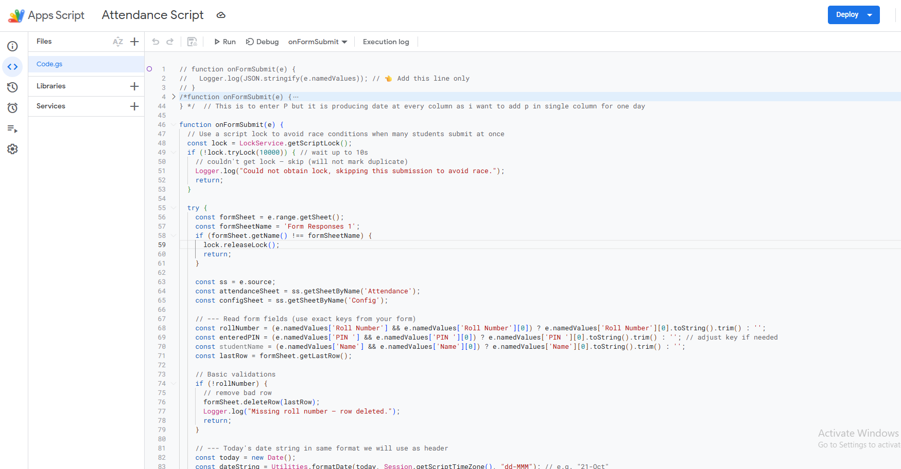

**Description:**  
This project automates attendance marking for students using **Google Forms** and **Google Sheets**. When a student submits their roll number, name, and PIN via the form, the script validates the submission and marks "P" (Present) in the corresponding column for that day in the Attendance sheet. It prevents duplicate entries, invalid PINs, and roll numbers not in the master attendance list.  

---

## Table of Contents
- [About](#about)  
- [Features](#features)  
- [Setup](#setup)  
- [Usage](#usage)  
- [Screenshots](#screenshots)  

---

## About
This project is useful for teachers and administrators who want to manage attendance digitally without manual intervention. It ensures:  

- Only one attendance per student per day  
- Automatic creation of date columns in the Attendance sheet  
- Validation using a configurable PIN  
- Duplicate submissions blocked  
- Logging of every operation  

---

## Features
- Automatic attendance marking on form submission  
- Daily column creation for attendance if it does not exist  
- PIN verification for secure submissions  
- Duplicate submission prevention  
- Easy logging for debugging  

---

## Setup
1. Create a **Google Form** with the following fields:  
   - Roll Number  
   - Name  
   - PIN  

2. Connect the form responses to a **Google Sheet**. Rename the response sheet as `Form Responses 1`.  

3. Create another sheet in the same Google Sheet called `Attendance` and list all students' roll numbers in column A.  

4. Create a `Config` sheet with the correct PIN in cell `A1`.  

5. Open **Extensions → Apps Script** and paste your attendance script.  

6. Set the **trigger**:  
   - Go to **Triggers → Add Trigger**  
   - Choose `onFormSubmit` → Event: `On form submit`  

---

## Usage
Once everything is set up:  
- Students submit the form with their roll number, name, and PIN.  
- The script automatically checks the PIN, verifies the roll number, and marks "P" for that day.  
- If a student submits twice, or enters wrong PIN, the form entry is deleted.  

---

## Screenshots
*(Add screenshots here showing your Attendance sheet and Form responses)*  

```markdown


